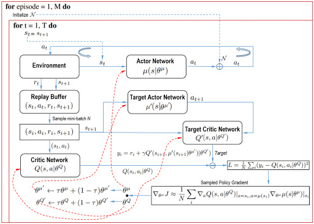

### Learning algorithm
Deep Deterministic Policy Gradient (DDPG) is a model-free off-policy algorithm for learning continous actions.
It combines ideas from DPG (Deterministic Policy Gradient) and DQN (Deep Q-Network). It uses Experience Replay 
and slow-learning target networks from DQN, and it is based on DPG, which can operate over continuous action spaces.
    This tutorial closely follow this paper [Continuous control with deep reinforcement learning](http://codsim.com/reinforcement-learning/deep-deterministic-policy-gradient)
    
### Pseudocode

### Hyper-parameters
Agent default hyperparameters: 
BUFFER_SIZE = int(1e6)  # Replay buffer size 
BATCH_SIZE = 256        # Batch size #128 
GAMMA = 0.99            # Discount Factor #0.99 
TAU = 1e-3              # Soft update of target parameters 
LR_ACTOR = 1e-4         # learning rate of the actor  
LR_CRITIC = 1e-4        # learning rate of the critic 
WEIGHT_DECAY = 0        # L2 weight decay 
ACTOR_FC1_UNITS = 256   # Number of units for L1 in the actor model 
ACTOR_FC2_UNITS = 128   # Number of units for L2 in the actor model 
CRITIC_FCS1_UNITS = 256 # Number of units for L1 in the critic model 
CRITIC_FC2_UNITS = 128  # Number of units for L2 in the critic model 
ADD_OU_NOISE = True     # Toggle Ornstein-Uhlenbeck noisy relaxation process 
THETA = 0.15            # k/gamma -> spring constant/friction coefficient [Ornstein-Uhlenbeck] 
MU = 0.                 # x_0 -> spring length at rest [Ornstein-Uhlenbeck] 
SIGMA = 0.2             # root(2k_B*T/gamma) -> Stokes-Einstein for effective diffision [Ornstein-Uhlenbeck] 

I tried several learning rates for Actor and Critic among [1e-2, 3e-3, 1e-3, 7e-4, 3e-4, 1e-4]. 
From tests, 1e-4(lr of Actor) and 1e-4(lr of Critic) were best. 

Number of nodes in layers of Actor and Critic among [(512, 256), (256, 128), (128, 64)]. 
(256, 128) was best. 

Sigma of Ornstein-Uhlenbeck process was one of critical points. 
0.2 was best for this environment. 

### Model architectures of this project
There are two neural networks as the actor and the critic.

* The Actor
1. First layer: (input: state size, 256)
   Batch normalization: (256)
   Activation function: Leaky ReLU
2. Second layer: (256, 128)
   Activation function: Leaky ReLU
3. Output layer: (128, action size)
   Activation function: Tanh

* The Critic
1. First layer: (input: state size, 256)
   Activation function: Leaky ReLU
   Batch normalization: (256)
2. Second layer: (256 + action size, 128)
   Activation function: Leaky ReLU
3. Output layer: (128, 1)
   Activation function: Linear

Leaky ReLU was used instead of ReLU for better performance. 

### Plot of Rewards

### Ideas for Future Work
D4PG implementation

